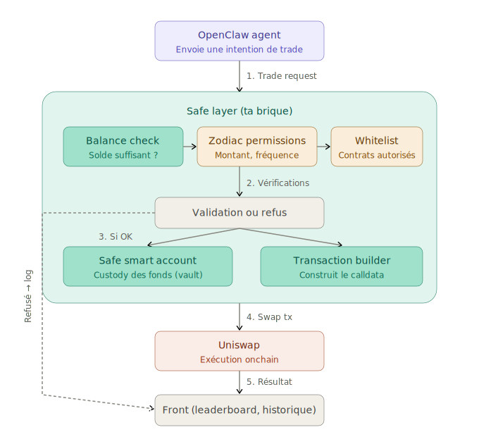

# OpenClaw Safe Layer

> Secure onchain custody and trade validation for AI agents.

## Overview

OpenClaw provides secure onchain skills for user-owned agents. Each agent can have an ENS identity that resolves to the user's Safe smart account. Trades are built through Uniswap and constrained by Zodiac permissions before execution through the Safe.

The **Safe Layer** acts as the security and control middleware between the AI agent and the blockchain. It protects funds, enforces permissions, and validates every trade request before any onchain execution.

## Architecture

<p align="center">
  
</p>

## Transaction flow

1. **Trade request** — The OpenClaw agent sends a trade intention (e.g. "swap 500 USDC → ETH")
2. **Balance check** — The Safe Layer verifies the vault holds enough funds
3. **Permission check** — Zodiac Roles module enforces: max amount, max trades/day, whitelisted contracts and tokens
4. **Validation** — If all checks pass, the transaction is built and executed through the Safe. If rejected, the reason is logged
5. **Execution** — The swap is sent to Uniswap via the Safe smart account
6. **Result** — The front displays the transaction, updated balances, and agent performance

## Safe Layer responsibilities

### Balance controls
- Token balance verification before each trade
- Available liquidity tracking
- Minimum / maximum amount enforcement
- Reserved funds management

### Permission controls (Zodiac Roles)
- Agent authorization (enabled / disabled)
- Protocol whitelist (e.g. Uniswap Router only)
- Function whitelist (e.g. `exactInputSingle` only)
- Token pair whitelist

### Risk controls
- Max amount per trade
- Max daily volume per agent
- Max number of trades per day
- Max exposure per agent (% of vault)
- Emergency stop

### Technical controls
- Transaction well-formed
- Slippage within bounds
- Deadline valid
- Target contract matches whitelist

## Uniswap integration notes

- Uniswap Trading API base should be set to `https://trade-api.gateway.uniswap.org` (with or without `/v1` in env; the service normalizes it).
- Quotes are requested through `/quote` and include routing plus optional `permitData`.
- Routing is handled automatically:
  - `CLASSIC`, `WRAP`, `UNWRAP`, `BRIDGE`, `CHAINED` -> swap flow
  - `DUTCH_V2`, `DUTCH_V3`, `PRIORITY`, `DUTCH_LIMIT`, `LIMIT_ORDER` -> order flow
- If `permitData` is returned by quote, the client must sign EIP-712 and pass the signature as `permit_signature`.
- `prepare-safe-tx` is only for swap-compatible routes (not UniswapX gasless order routes).
- Uniswap API requests retry on HTTP 429 using exponential backoff.

## API examples

### Import a Safe
```bash
curl -X POST http://localhost:8000/v1/safes/import \
  -H "Content-Type: application/json" \
  -d '{
    "safe_address": "0x1234567890123456789012345678901234567890",
    "chain_id": 8453
  }'
```

### Create ENS subname
```bash
curl -X POST http://localhost:8000/v1/ens/subnames \
  -H "Content-Type: application/json" \
  -d '{
    "parent_name": "openclaw.eth",
    "label": "alice-trader",
    "safe_address": "0x1234567890123456789012345678901234567890"
  }'
```

### Set ENS records
```bash
curl -X PUT http://localhost:8000/v1/ens/records \
  -H "Content-Type: application/json" \
  -d '{
    "name": "alice-trader.openclaw.eth",
    "address": "0x1234567890123456789012345678901234567890",
    "texts": {
      "agent:type": "trader",
      "agent:capabilities": "quote,swap",
      "agent:api": "https://api.openclaw.xyz/v1/agents/alice-trader",
      "agent:safe": "0x1234567890123456789012345678901234567890"
    }
  }'
```

### Get quote
```bash
curl -X POST http://localhost:8000/v1/trades/quote \
  -H "Content-Type: application/json" \
  -d '{
    "chain_id": 8453,
    "safe_address": "0x1234567890123456789012345678901234567890",
    "token_in": "0x833589fCD6EDB6E08f4c7C32D4f71b54bdA02913",
    "token_out": "0x4200000000000000000000000000000000000006",
    "amount_in": "1000000",
    "slippage_bps": 50
  }'
```

### Build trade (swap or order based on routing)
```bash
curl -X POST http://localhost:8000/v1/trades/build \
  -H "Content-Type: application/json" \
  -d '{
    "chain_id": 8453,
    "safe_address": "0x1234567890123456789012345678901234567890",
    "token_in": "0x833589fCD6EDB6E08f4c7C32D4f71b54bdA02913",
    "token_out": "0x4200000000000000000000000000000000000006",
    "amount_in": "1000000",
    "slippage_bps": 50,
    "permit_signature": "0x..."
  }'
```

### Build Safe-ready tx (swap routes only)
```bash
curl -X POST http://localhost:8000/v1/trades/prepare-safe-tx \
  -H "Content-Type: application/json" \
  -d '{
    "chain_id": 8453,
    "safe_address": "0x1234567890123456789012345678901234567890",
    "token_in": "0x833589fCD6EDB6E08f4c7C32D4f71b54bdA02913",
    "token_out": "0x4200000000000000000000000000000000000006",
    "amount_in": "1000000",
    "slippage_bps": 50,
    "permit_signature": "0x..."
  }'
```


